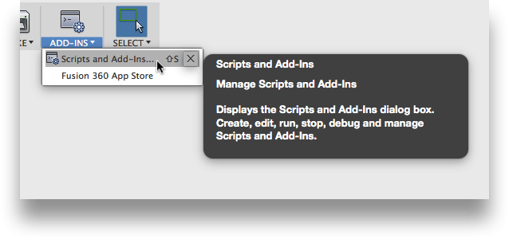

# Fusion 360 Project Data Importer
Script to import local documents into a new project and folder structure based on local folder structure.

# NEEDS TO BE REWRITTEN FOR ADDIN

Also has option to export a project to be used for the import script.

 * [How to install](#How-to-install)
 * [How to use import](#How-to-use-import)
 * [How to use export](#How-to-use-export)
 * [Configuration Options](#Configuration-Options)

----

## How to install<a name="How-to-install"></a>

Could update this based on the permanent download location.

1. **Insert link to Download Zip**
2. For now [download the repo from here.](https://github.com/tapnair/ProjectDataImporter/archive/refs/heads/master.zip)
3. Rename zip file to be: `ProjectUtilities`
4. Un-Zip to any convenient location.

__Important! Directory must have the same name as the python script__

## How to use import<a name="How-to-use-import"></a>

1. Open the config.py file
2. Ensure the value of `DO_EXPORT` is set to: `False`
3. On the main toolbar click the **Scripts and Addins** button in the **Addins** Panel

    

4. Click the green plus button and navigate to the script directory.
5. Now on the **Scripts tab** and find: ProjectDataImporter.  
6. Click run.  
 
    

_The script will now import all Fusion 360 files in the local directory._

   

----

## How to use export<a name="How-to-use-export"></a>

1. Open the config.py file
2. Change the value of `DO_EXPORT` to: `True`
3. In the data panel navigate to the project you want to export.
4. Follow steps above to run the script
5. Select OK to confirm running the export.  This may take some time...

   

The add-in will export all Fusion 360 files in the active project.

You can view results of the export by expanding the Text Commands palette.

   

_It is important to note that assemblies with XREFS and Drawings_ 
_must be manually exported as f3z files._

_After manually exporting f3z files, simply place them in the_
_appropriate position in the local folder structure._

----

## Configuration Options<a name="Configuration-Options"></a>

Open the `config.py` file.  

You can set a number of options that may be useful when developing the dataset.

These options are primarily provided for use while testing and configuring 
the initial dataset that will be provided in the final distribution.

Before distribution these should probably be set to the appropriate defaults.

```
# *************************** Script Options ****************************
# Fusion 360 Project Name
PROJECT_NAME = 'Project Import Test'

# Name of local folder for Fusion 360 Files
LOCAL_FUSION_FOLDER = 'FusionFiles'

# When set to True, it will export the active Fusion 360 project
# This will also disable the import function
DO_EXPORT = True

# When set True, it will skip import when file already exists in project
SKIP_IMPORT_ON_DUPLICATES = True

# When set True, it will skip exporting files with parent references
SKIP_EXPORT_ON_PARENTS = True

# When set True, it will skip exporting files with child references
SKIP_EXPORT_ON_CHILDREN = True

# When set True, will skip export when file already exists in folder
SKIP_EXPORT_ON_DUPLICATES = True

# When set True, will show text command palettes automatically
# Particularly useful when running export command
# For mass distribution should probably be set False
AUTO_SHOW_TEXT_COMMAND_PALETTE = False
# ***********************************************************************
```

----

## License
Copyright 2022 by Patrick Rainsberry

AUTODESK PROVIDES THIS PROGRAM "AS IS" AND WITH ALL FAULTS. AUTODESK SPECIFICALLY
DISCLAIMS ANY IMPLIED WARRANTY OF MERCHANTABILITY OR FITNESS FOR A PARTICULAR USE.
AUTODESK, INC. DOES NOT WARRANT THAT THE OPERATION OF THE PROGRAM WILL BE
UNINTERRUPTED OR ERROR FREE.

Samples are licensed under the terms of the [MIT License](http://opensource.org/licenses/MIT). Please see the [LICENSE](LICENSE) file for full details.

## Written by

Written by [Patrick Rainsberry](https://twitter.com/prrainsberry) <br /> (Product Manager, Autodesk Fusion 360)


